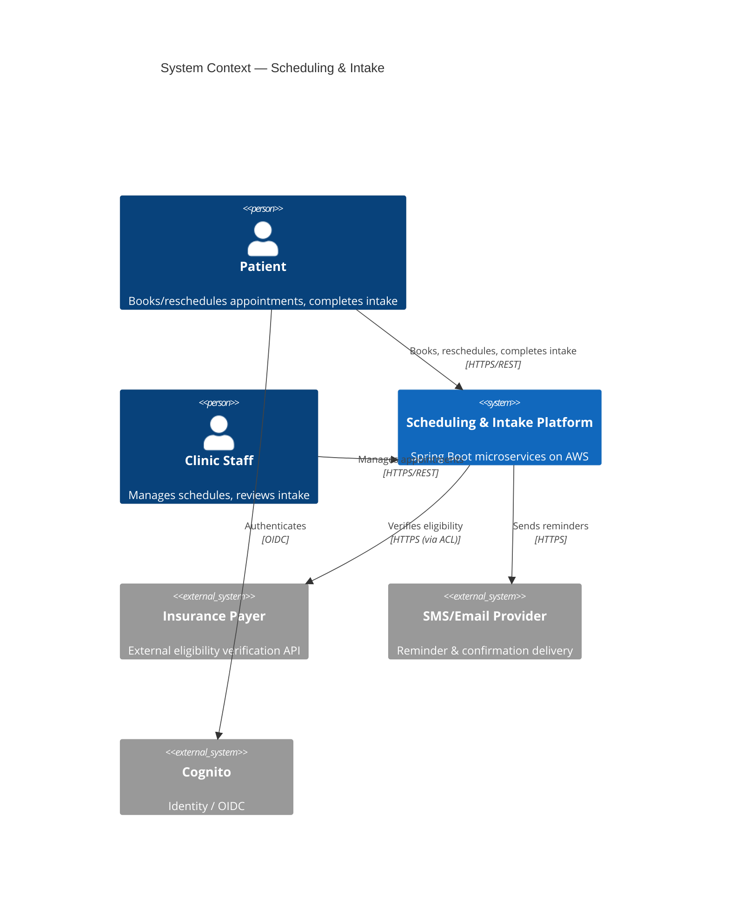
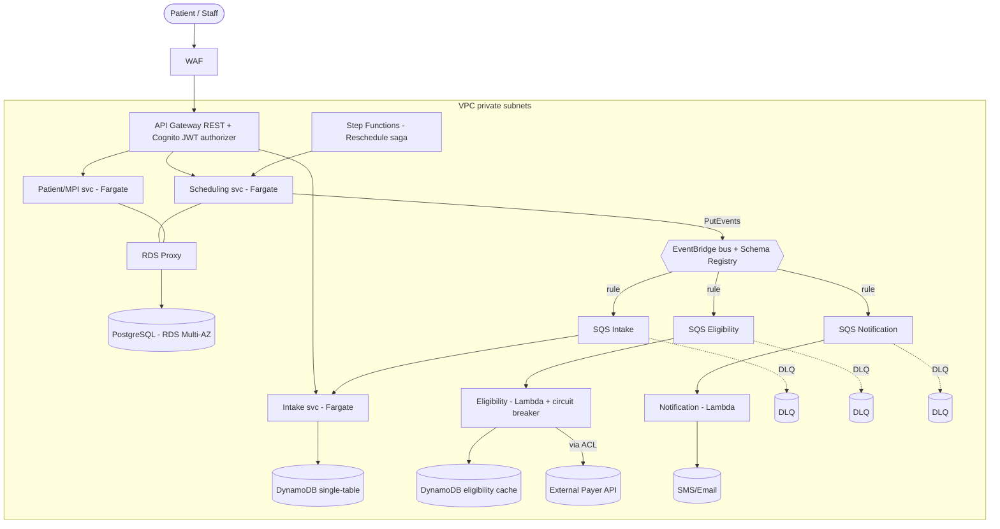

# Patient Scheduling & Intake — Architecture

> **What this is.** A documented reference architecture for the modernization of a legacy
> healthcare **practice-management** system: a single on-prem **JBoss** monolith migrated to
> **Spring Boot microservices on AWS** (~2020–2021). It is a portfolio/reference artifact —
> one vertical slice is built to run locally (see [Fidelity & Scope](#12-fidelity--what-is-built-vs-described));
> the rest is expressed as Infrastructure-as-Code and these documents.

---

## 1. Context & problem

The legacy system was a JBoss (Java EE / EJB) monolith fronting **one shared relational
database**, bundling four capabilities that change at very different rates and have very
different access-control needs:

- **Scheduling** — appointments and provider availability (high write churn, needs strong consistency)
- **Patient** — demographics / master patient index (changes rarely, referenced everywhere, PHI-heavy)
- **Intake** — clinical intake forms (schema varies by specialty)
- **Eligibility & Notification** — insurance checks (slow, flaky external payer) and reminders

Pain points: on-prem capacity ceilings, a release cadence throttled by the shared codebase and
database, and an inability to scale or deploy any one capability independently.

**Goal:** exit the data center, decompose along business-capability seams, adopt event-driven
integration, and do it **incrementally with zero downtime** for a system clinics use all day.

### Non-functional requirements

| NFR | Target |
|---|---|
| Availability (booking path) | 99.9% (multi-AZ) |
| Booking API latency | p99 < 300 ms |
| Migration | Zero-downtime, reversible per seam |
| Security/compliance | HIPAA; PHI encrypted at rest & in transit, audited |
| DR (described) | RTO 1h / RPO 5min |
| Delivery | Independent per-service deploys; blue/green |

---

## 2. System context (C4 L1)



## 3. Container view (C4 L2)



## 4. Bounded contexts

Decomposed by **business capability + data ownership + rate of change** — not per-entity.
**Database-per-service; no shared database.** Cross-service data travels by event payload or a
sync read API, never a shared schema.

| Service | Owns | Store | Rationale |
|---|---|---|---|
| **Scheduling** | Appointments, provider slots | PostgreSQL (RDS Multi-AZ) | Transactional core; ACID prevents double-booking; highest churn |
| **Patient (MPI)** | Identity & demographics | PostgreSQL | Referenced everywhere, changes rarely; distinct PHI access policy |
| **Intake** | Forms, questionnaires, clinical docs | DynamoDB (single-table) | Variable per-specialty schema → document model |
| **Eligibility** | Insurance verification | DynamoDB (cache) | Anti-corruption layer over slow/flaky external payer; isolates that failure domain |
| **Notification** | Reminders, confirmations | none (stateless) | Pure event consumer; fans out without blocking booking |

See [ADR-0001](adr/0001-bounded-context-decomposition.md).

---

## 5. Key flows

### 5.1 Booking — synchronous command, single-service ACID

```mermaid
sequenceDiagram
  participant C as Client
  participant G as API Gateway
  participant S as Scheduling (Fargate)
  participant P as PostgreSQL
  participant E as EventBridge
  C->>G: POST /appointments (JWT)
  G->>S: validated request
  S->>P: BEGIN; flip slot AVAILABLE→BOOKED<br/>(optimistic version + unique index)
  alt slot taken / version stale
    P-->>S: constraint/version conflict
    S-->>C: 409 Conflict
  else success
    P-->>S: committed
    S-->>C: 201 Created (appointment)
    S->>E: PutEvents AppointmentBooked (correlationId)
  end
```

Strong consistency lives in exactly one service. The client API is **synchronous** (`201`, not
`202`); "event-driven" describes the *internal* reactions only. See [ADR-0007](adr/0007-relational-and-nosql-data-stores.md).

### 5.2 Reactions — asynchronous choreography (eventual consistency)

`AppointmentBooked` fans out via EventBridge rules to per-consumer SQS queues (each with a DLQ):

- **Intake** → create a blank intake form for the appointment
- **Eligibility** → verify with the payer through the ACL (circuit-breaker protected)
- **Notification** → send confirmation + schedule reminder

Consumers are **idempotent** (dedupe on event ID — SQS is at-least-once). See [ADR-0003](adr/0003-event-driven-backbone-eventbridge-sqs.md), [ADR-0004](adr/0004-choreography-and-reschedule-saga.md).

### 5.3 Reschedule — orchestrated saga with compensation

The one flow needing central coordination + rollback: reserve new slot → on success release old;
on failure/timeout compensate (release new, keep old). Modeled in **Step Functions**. Choreography
everywhere else; orchestration only where a timeout + compensation is genuinely required.

### 5.4 Graceful degradation

Eligibility is **informational, not a gate**. When the payer is down, the **circuit breaker** opens,
eligibility is marked `pending`, and **booking still completes**. See [ADR-0009](adr/0009-ha-and-resilience.md).

---

## 6. Data architecture

**PostgreSQL / Scheduling** — availability modeled as discrete slot rows:

```
availability_slots(id, provider_id, start_ts, end_ts, status, version, appointment_id?)
appointments(id, patient_id, provider_id, slot_id, status, correlation_id, created_at)
```

Double-booking prevented by **optimistic `version` (fast path → 409) + a unique partial index on
`(provider_id, start_ts) WHERE status='BOOKED'` (hard safety net)**. Correctness does not depend on
application logic.

**DynamoDB / Intake** — single-table, designed from access patterns first:

```
PK = APPOINTMENT#<id>    SK = FORM#<id>       + form JSON (schemaless attribute)
GSI1: PK = PATIENT#<id>  SK = APPOINTMENT#<ts>
```

Rigid, access-pattern-shaped keys; flexible document payload — the explicit reason it is NoSQL.
See [ADR-0007](adr/0007-relational-and-nosql-data-stores.md).

---

## 7. Migration strategy (strangler-fig at the data layer)

Per seam, reversible at every step; Scheduling first (highest churn, cleanest boundary),
Patient/MPI last (most referenced, riskiest).

1. **Containerize JBoss → Fargate** (lift-and-shift; exit the data center).
2. **Façade** (ALB / API Gateway) so routes redirect per-path, invisibly to clients.
3. Stand up the new Spring Boot service with its **own** database.
4. **CDC + dual-write:** Debezium/AWS DMS replicate the monolith's tables → new store, backfill
   history, **dual-write** new operations to both, then cut reads over, then stop old writes.
5. **Reconciliation jobs** (row counts / checksums) **prove data parity before** any cutover.
6. **Cut over per route behind the façade; roll back by flipping the route.** Decommission the
   seam in the monolith once 100% on the new service and reconciliation is clean. Repeat.

The hard part is splitting a **shared schema** with foreign keys across would-be service
boundaries — not the code. See [ADR-0002](adr/0002-strangler-fig-cdc-migration.md).

---

## 8. Security & HIPAA

- **Encryption:** KMS CMKs at rest (RDS, DynamoDB, S3, SQS); TLS in transit; **field-level
  envelope encryption** on ultra-sensitive fields (SSN, member ID).
- **Network:** private subnets; VPC endpoints (no internet egress for AWS-service calls);
  public surface = API Gateway + WAF only.
- **Identity & access:** Cognito (OIDC/JWT); **per-service least-privilege IAM roles**.
- **Secrets:** Secrets Manager with rotation.
- **Audit:** CloudTrail + an **immutable PHI access log** (S3 Object Lock); **PHI scrubbed from
  application/CloudWatch logs**.
- **Governance:** BAA-eligible services only; data-classification tags; AWS Config / policy-as-code
  drift detection.

See [ADR-0008](adr/0008-security-and-hipaa.md).

---

## 9. High availability & resilience

- Multi-AZ baseline (RDS Multi-AZ; DynamoDB/Lambda/SQS/EventBridge multi-AZ by design).
- DLQs + exponential backoff with jitter + idempotent consumers + async failure isolation.
- **Lambda reserved concurrency as DB backpressure** (Lambda scales infinitely; Postgres does not).
- **Circuit breaker + timeout** on the Eligibility ACL → graceful degradation.
- **DR (described):** RTO 1h / RPO 5min via DynamoDB global tables, RDS cross-region replica,
  Route 53 health-check failover, region-redeployable IaC.

See [ADR-0009](adr/0009-ha-and-resilience.md).

---

## 10. Delivery (DevOps / CI-CD)

- **Stack:** Java / **Spring Boot**, **Maven**, **Terraform** (directory/module-per-env).
- **CI:** GitHub Actions + OIDC (no long-lived keys). Pipeline: unit (JUnit5/Mockito/JaCoCo) →
  static (SpotBugs/Sonar) → security scans (SAST, OWASP Dependency-Check, Trivy, tfsec) →
  image → ECR → `terraform plan` + policy gate (OPA/Conftest) → **Testcontainers + LocalStack**
  integration → **Pact** contract tests (gate breaking event-schema changes) → staging smoke →
  prod (manual approval).
- **DB migrations:** Flyway, versioned, as a pipeline step.
- **Deploys:** **blue/green via ECS + CodeDeploy** (ALB target-group shift; instant rollback).

See [ADR-0010](adr/0010-iac-and-cicd.md).

---

## 11. Observability

- **Tracing:** AWS X-Ray across API GW → Fargate → EventBridge → Lambda; **trace/correlation
  context injected into EventBridge event metadata** so traces survive async boundaries — the
  mitigation for choreography's "no single end-to-end view."
- **Metrics:** CloudWatch dashboards incl. business SLIs (bookings/min, eligibility-failure rate,
  DLQ depth).
- **SLOs & error budgets** → alarms → SNS → PagerDuty/Slack.

See [ADR-0011](adr/0011-observability.md).

---

## 12. Fidelity — what is built vs described

**Built (runnable locally via docker-compose + LocalStack):** the `AppointmentBooked` vertical
slice — Scheduling → Intake → Notification — plus field-level encryption, PHI-redacted logging,
correlation-ID propagation, and the Eligibility circuit breaker as a standalone artifact.

**Described (IaC + these docs):** Patient (MPI), full Eligibility integration, VPC/KMS/WAF/Object
Lock, blue/green deploys, multi-region DR.

---

## 13. Present-day deltas (forward notes)

This documents a ~2021 design. Were it built today:

- **Lambda SnapStart** (GA Nov 2022) would make Java-on-Lambda viable for more services.
- **OpenTelemetry / ADOT** would replace X-Ray-native instrumentation for vendor neutrality.
- **AI-assisted development** (not practical in 2021) would accelerate scaffolding/tests/docs —
  governed so AI output passes the same CI gates and **no PHI/secrets ever enter a prompt**.

---

## Decision log

| ADR | Decision |
|---|---|
| [0001](adr/0001-bounded-context-decomposition.md) | Bounded-context decomposition (5 contexts) |
| [0002](adr/0002-strangler-fig-cdc-migration.md) | Strangler-fig migration with CDC + dual-write |
| [0003](adr/0003-event-driven-backbone-eventbridge-sqs.md) | Event-driven backbone: EventBridge + SQS + DLQs |
| [0004](adr/0004-choreography-and-reschedule-saga.md) | Choreography default + Step Functions reschedule saga |
| [0005](adr/0005-compute-fargate-and-lambda.md) | Compute: Spring Boot on Fargate, Lambda for event glue |
| [0006](adr/0006-api-rest-cognito.md) | API: contract-first REST, API Gateway REST, Cognito |
| [0007](adr/0007-relational-and-nosql-data-stores.md) | Data: PostgreSQL + DynamoDB single-table |
| [0008](adr/0008-security-and-hipaa.md) | Security & HIPAA posture |
| [0009](adr/0009-ha-and-resilience.md) | HA & resilience |
| [0010](adr/0010-iac-and-cicd.md) | IaC & CI/CD: Terraform, Maven, GitHub Actions, blue/green |
| [0011](adr/0011-observability.md) | Observability: X-Ray + SLOs |
